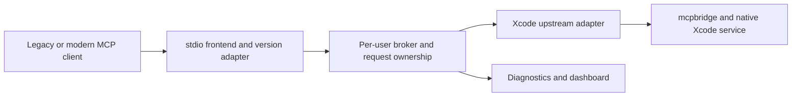

# September 2026 MCP Audit and Update Plan

Date: 2026-09-22. Status: accepted implementation contract for the experimental 1.0.0 branch.
Baseline: local `main`, commit `177e4d93149a14337cab3809733b13c00753873e`, package `0.4.5`.
Scope: source, tests, packaging, CI, documentation, official MCP/SDK/Apple documentation, and read-only local Xcode diagnostics. No application code, configuration, permissions, branches, or releases were changed.

## Decision Summary

Retain the option of one broker per macOS user. Separate its process lifetime and Xcode connection ownership from the MCP protocol exposed to clients. Implementing modern MCP requires a protocol adapter, not replacing one version string or deleting the daemon.

Before committing to a larger broker, compare it against Xcode 27's native headless MCP server. Native lifecycle and durable permissions now overlap with part of the project's original motivation. The remaining product value must be measured: response repair, interoperability, multiplexing, diagnostics, and observability.

Recommended order: capture the native baseline; repair request isolation; choose the protocol engine; deliver dual-era stdio support; validate release and upgrade behavior. A remote HTTP endpoint is a separate product decision, not a prerequisite for modern MCP.

## Evidence and Limits

- Two read-only subagents used `gpt-5.6-luna` with `low` reasoning: broker/protocol and tooling/docs. Their findings were checked against source before inclusion.
- Local commands confirmed `Xcode 27.0`, build `27A266a`; `xcrun mcpbridge --help` still describes a stdio bridge.
- `xcrun mcp-server --help` describes native lifecycle, headless mode, agent/folder permissions, and status. Its help explicitly says agents still connect through `mcpbridge`.
- At audit time `xcrun mcp-server status` reported enabled/running. The Python 3.10 host was classified by this service as unsigned, with a time-limited permission expiring 2026-09-23 07:41:46 UTC. This is the service's observed classification, not an independent codesign assessment.
- No real MCP request, build, test, file modification, permission approval, or daemon restart was sent to Xcode during this audit. Native wire version, current structured-output defects, and client compatibility remain unverified.
- Five in-memory transformation probes ran with `python3 -B`: existing null/array structured content and an MRTR result were preserved; a legacy tool response gained structured content but no result type; a modern tool list gained no cache hints.
- The full test suite and a dependency vulnerability scanner were not run. Historical coverage and earlier Xcode 26.5 success are not September 2026 compatibility evidence.
- DocC infrastructure exists (`Package.swift`, `Sources/XcodeMCPWrapper/Documentation.docc`); its existence is not a defect. No removal is proposed.

## What the New Standard Actually Is

The wire revision is **MCP `2026-07-28`**. Python SDK **v2** is a separate release identifier; `jsonrpc: "2.0"` is another independent identifier. The official repository marks the July revision stable. Do not advertise the wrapper merely as "MCP 2.0 compatible" without naming supported wire revisions and transports. [Official release](https://github.com/modelcontextprotocol/modelcontextprotocol/releases/tag/2026-07-28), [SDK v2](https://github.com/modelcontextprotocol/python-sdk/releases/tag/v2.0.0).

The ten supplied screenshots accurately summarize several changes, but omit important migration requirements:

| Screenshots | Verified meaning | Consequence for this project |
| --- | --- | --- |
| 1-3 | Modern requests carry protocol version and capabilities in `params._meta`; no initialization handshake | Add version-aware dispatch, including calls made without prior discovery |
| 2 | Protocol context cannot depend on connection history | A long-lived broker is still possible; per-request context must be explicit |
| 4 | Method/name and annotated parameter headers apply to HTTP | No synthetic HTTP headers are needed on stdio or the internal Unix socket |
| 5 | Request-scoped SSE remains; old GET stream/session mechanics are removed | Relevant only if an HTTP MCP endpoint is introduced |
| 6 | Cache freshness and authorization scope are explicit | Replace the single unqualified tools cache |
| 7-10 | Elicitation moves into MRTR results and subsequent requests | Preserve continuation fields and distinguish operation completion from a single round trip |

The base protocol requires `resultType`, mandatory version/capability metadata, and defined errors for missing metadata/capabilities. Client identity is recommended, not mandatory and not authenticated. These rules also apply over stdio. [Base protocol](https://modelcontextprotocol.io/specification/2026-07-28/basic), [stdio](https://modelcontextprotocol.io/specification/2026-07-28/basic/transports/stdio).

Modern servers must implement `server/discover`; clients may skip it. Discovery advertises `supportedVersions`, capabilities, and optional identity in result `_meta`. Dual-era stdio clients can probe discovery before falling back to legacy initialization; recognized modern errors must not be mistaken for legacy fallback. [Discovery](https://modelcontextprotocol.io/specification/2026-07-28/server/discover), [Versioning](https://modelcontextprotocol.io/specification/2026-07-28/basic/versioning).

Subscriptions use `subscriptions/listen`, a first acknowledgement, explicit filters, and `subscriptionId` correlation. They are long-lived requests; reconnect requires resubscription. Progress is separately correlated to active request tokens. [Subscriptions](https://modelcontextprotocol.io/specification/2026-07-28/basic/patterns/subscriptions), [Progress](https://modelcontextprotocol.io/specification/2026-07-28/basic/patterns/progress).

MRTR retries have new request IDs and echo opaque `requestState`. Intermediaries must not reinterpret upstream continuation state. If the wrapper creates its own state that affects execution or access, protect integrity and bind it to the appropriate caller, operation, and expiry; single-use semantics require additional enforcement. Do not implement continuation by blindly replaying a mutating Xcode tool. [MRTR](https://modelcontextprotocol.io/specification/2026-07-28/basic/patterns/mrtr).

Cache hints apply to complete discovery/list/resource-read results. Cache keys include relevant parameters, including pagination cursor; private entries cannot cross authorization contexts. MRTR continuations are not cacheable. A conservative adapter may initially emit `ttlMs: 0` and `cacheScope: "private"`. [Caching](https://modelcontextprotocol.io/specification/2026-07-28/server/utilities/caching).

Structured output may be any JSON value. Declared output schemas still constrain results; the new revision does not make a fabricated `{text: ...}` result schema-compliant. Schema dialect/ref handling must be explicit, with network reference resolution disabled by default. [Tools](https://modelcontextprotocol.io/specification/2026-07-28/server/tools), [Schema requirements](https://modelcontextprotocol.io/specification/2026-07-28/basic#json-schema-usage).

Other omitted changes: Tasks is an extension, Roots/Sampling/Logging are deprecated, and several standalone methods are removed in the modern era. HTTP authorization adds issuer/credential hardening and the transition toward client metadata documents. These are not a requirement to add OAuth to the local stdio wrapper. [Changelog](https://modelcontextprotocol.io/specification/2026-07-28/changelog), [HTTP binding](https://modelcontextprotocol.io/specification/2026-07-28/basic/transports/streamable-http).

## Xcode 27 Changes the Product Baseline

Apple's current release-notes JSON, fetched directly because indexed English pages still showed early betas, documents native headless MCP, extended permissions for signed agents, dynamic build/test activity, and an expanded tool surface. It also lists macOS Tahoe 26.6 as the Xcode 27 host minimum. The new headless experience retains preview caveats. [Release notes](https://developer.apple.com/documentation/xcode-release-notes/xcode-27-release-notes), [Machine-readable source](https://developer.apple.com/tutorials/data/documentation/xcode-release-notes/xcode-27-release-notes.json).

Planning implications:

1. Test native `mcpbridge` with native headless mode before assuming a wrapper-owned daemon is required to reduce prompts.
2. Keep three concepts separate: transport/process identity, Xcode permission identity, and self-reported MCP `clientInfo`.
3. A stable Python path, a signed interpreter, and a stable signed application identity are not interchangeable guarantees. Evaluate the actual identity Xcode authorizes across updates.
4. Preserve `uvx ... --broker` as a supported installation/launch candidate. `uvx` can launch a client of a persistent daemon, but cannot by itself promise stable permissions across Python or package replacement.
5. Do not reset or enable native permissions as a migration side effect. `--broker-stop` must continue to refer to the wrapper daemon, distinct from `xcrun mcp-server stop`.
6. Refresh tool fixtures from exact Xcode builds, including progress, preview media/metadata, debugger/build settings, and tools that mutate shared IDE state. Do not hardcode a timeless tool count.

## Findings

Priority P0 below means a prerequisite or blocker for the proposed modern-compatible release, not a claim that all current legacy clients are broken.

| ID | Priority / classification | Evidence | Impact and proposed response |
| --- | --- | --- | --- |
| A01 | P0, modern compatibility gap | `broker/daemon.py:341`, `broker/transport.py:470` | Upstream initialization proposes `2024-11-05` with empty capabilities; downstream initialization replays one cached response. Add independent upstream negotiation and downstream protocol handling. No local discovery handler or required per-request checks exist. |
| A02 | P0, existing routing defect | `broker/transport.py:562`, `broker/transport.py:601`; forwarding test `tests/unit/test_broker_transport.py:472` | Requests get broker IDs, but forwarded cancellation keeps the client's nested `params.requestId`. Upstream cannot reliably cancel the intended operation. Resolve nested IDs through the same ownership map and test cancellation outcomes. |
| A03 | P0, existing isolation defect and modern gap | `broker/transport.py:282`, `broker/transport.py:648` | All messages without IDs are broadcast. Progress can reach unrelated clients; identical client progress tokens are not namespaced. Route progress per request, and subscriptions by explicit ownership/filter. Do not equate same UID with same conversation. |
| A04 | P1, cache correctness gap | `broker/transport.py:553`, `broker/daemon.py:430` | A single raw tools/list response is served regardless of request parameters. No TTL/scope policy exists. Cursor-bearing requests can receive the wrong page. Key caches explicitly and invalidate by upstream generation and access context. |
| A05 | P1, readiness ambiguity | `broker/daemon.py:430` | Empty catalogs are classified as not-ready, although a valid server can have zero tools. Model permission pending, disconnected, ready-empty, and ready-nonempty separately. Do not solve the historical approval race by rejecting every legitimate empty catalog. |
| A06 | P1, adapter gap | `transform.py:62`, `transform.py:121`, `transform.py:234` | The repair uses the first text block without output-schema knowledge. It does not synthesize modern result/cache envelopes. Make repair method-, revision-, and schema-aware and preserve valid upstream results. |
| A07 | P1, observability/schema gap | `schemas.py:31`, `schemas.py:88`, `schemas.py:101` | Identity extraction is initialize-only; result models omit modern result/continuation fields. Request parameters allow extras and the raw forwarding path preserves them, so this is not proof of wire data loss. Add typed interpretation without losing unknown metadata. |
| A08 | P1, runtime support drift | `pyproject.toml:10`, `pyproject.toml:112`, `pyproject.toml:150`, `scripts/install.sh:48`, `.github/workflows/ci.yml:56` | Package says 3.9+, installer/Ruff say 3.7, CI covers 3.9-3.12. Choose a supported floor and align all surfaces. See runtime proposal below. |
| A09 | P1, release integrity gap | `.github/workflows/publish-mcp.yml:3`, `:47` | Publishing is independent of CI and lacks tag/package/registry equality checks. Manual branch dispatch derives a nonempty `refs/heads/...` value, so its stated version fallback does not run. Gate publication and test ref handling. |
| A10 | P1, incomplete quality evidence | `pyproject.toml:95`, `Makefile:46`, `.github/workflows/ci.yml:69`, `tests/unit/webui/test_server.py:11` | Main tests discover Web UI tests, but CI installs only dev extras; HTTP tests can skip without FastAPI/Uvicorn and coverage excludes Web UI. Add an explicit extras lane and separate meaningful coverage policy. |
| A11 | P2, documentation/product gap | `server.json:12`, `docs/architecture.md:5`, `scripts/xcode_approval_harness.py:16` | Product surface is stdio plus internal Unix socket; dashboard HTTP/WebSocket is not MCP HTTP. Harness still probes the old lifecycle. Update compatibility docs, native/legacy setup, and probing examples together with DocC. |

Existing strengths worth preserving: per-user ownership, socket credential checks and permissions, reversible request ID aliases, delayed catalog readiness for approval handling, reconnect cleanup, diagnostics, package-asset checks, and documentation synchronization.

### Findings Deliberately Not Claimed

- Existing `structuredContent` arrays and null are preserved; JSON parsing already accepts scalar values. The issue is repair correctness and missing modern semantics, not an object-only parser.
- A well-formed `input_required` result is currently passed through. It is not automatically converted to `-32601`; that normalization requires `isError`. Passing bytes through does not establish cross-era MRTR compatibility.
- Raw per-request `_meta` is not universally stripped. The missing pieces are validation, interpretation, capability mediation, and accurate observability.
- Native Xcode 27 supporting modern MCP, fixing all structured-output problems, or eliminating all prompts was not demonstrated.
- A high legacy unit-test coverage percentage is not protocol conformance or real-client compatibility proof.

## Target Architecture and Compatibility

Keep protocol-specific transformations in one shared layer used by direct and broker modes. Otherwise the two launch paths will diverge. Broker-local discovery must advertise the wrapper's actually implemented contract, not copy every upstream capability. Preserve Xcode identity separately in diagnostics.

| Downstream | Xcode upstream | Planned behavior |
| --- | --- | --- |
| Legacy | Legacy | Preserve validated handshake and current behavior, with routing fixes |
| Modern | Legacy | Locally serve discovery/modern envelopes, translate only supported operations; explicitly constrain unsupported interactions |
| Modern | Modern | Negotiate upstream independently; preserve modern payloads and remap ownership identifiers |
| Legacy | Modern | Add explicit compatibility translation after fixtures prove semantics, or return an actionable unsupported-mode error |

Application state remains real: Xcode workspace, debugger state, build destination, and permissions may be shared. `tabIdentifier` and other handles must remain explicit. Do not manufacture conversation isolation from a socket ID. Establish concurrency behavior for operations that change a shared scheme, destination, debugger, or workspace.

## Engine and Runtime Proposal

Evaluate the official Python SDK v2 as the protocol engine first. It supports both eras and Python 3.10+, but the current package has no `mcp` dependency: this is an architectural adoption, not a dependency bump. Keep Xcode-specific repair, ownership, and daemon management outside the SDK boundary. [SDK requirements](https://github.com/modelcontextprotocol/python-sdk), [Migration overview](https://github.com/modelcontextprotocol/python-sdk/blob/main/docs/whats-new.md).

Compare a thin SDK adapter against a custom codec using the same fixtures: startup/import cost, memory, preservation of extensions/media, cancellation semantics, unknown-field handling, and injectable transports. Prefer the SDK if it meets these tests; retain custom protocol code only with an explicit maintenance/conformance justification. Do not replace the whole broker merely to adopt SDK classes.

Do not assume SDK v2 implements every extension: its roadmap lists Tasks as deferred from 2.0, despite broad ecosystem support claims. Pin a tested SDK release and track its actual supported features. [SDK roadmap](https://github.com/modelcontextprotocol/python-sdk/blob/main/ROADMAP.md).

Proposed new-release Python floor: **3.11**, CI on **3.11-3.14**, with **3.12+ recommended for a new broker host**. Confirm dependency wheels on macOS ARM64; treat 3.15 as a separate preview lane until stable. This is a product support choice, not a protocol requirement. Python 3.9 is EOL; 3.10 reaches EOL in October 2026. [Python support lifecycle](https://devguide.python.org/versions/).

For dependencies, test the lowest supported set and a resolved current set, maintain reproducible CI constraints, and scan advisories. No particular dependency vulnerability is asserted by this audit. Raising Python requirements must include uvx resolution, cached old versions, host identity, and upgrade/rollback tests.

## Proposed Backlog

Effort is relative: S = narrow change; M = several coordinated modules; L = protocol/lifecycle work. These are not calendar estimates. IDs are audit-local and do not alter `SPECS/Workplan.md` or `next.md`.

| Task | Priority | Size | Depends on | Deliverable and exit criterion |
| --- | --- | --- | --- | --- |
| M26-01 Native baseline | P0 | M | None | Capture exact Xcode 26.5 and 27 build, native/direct/broker responses, versions, catalogs, permission behavior. Determine which original defects still exist. No speculative version support claim. |
| M26-02 Contract/engine decision | P0 | M | M26-01 | Compare SDK v2 and custom adapter; approve supported revisions/transports/capabilities and the four-way matrix. Prototype fixtures only, no public release claim. |
| M26-03 Request ownership | P0 | M | None | Fix nested cancellation IDs, namespace progress, route only to owner, suppress late messages after cancellation; two-client collision tests pass. |
| M26-04 Dual-era core | P0 | L | M26-02, M26-03 | Discovery, per-request validation, version errors, result envelopes, independent upstream negotiation. Direct and broker paths pass pinned-modern and legacy clients. |
| M26-05 Catalog semantics | P1 | M | M26-04 | Empty-ready state, cursor-aware cache keys, TTL/private scope, deterministic catalog strategy, invalidation on permission/tool/upstream changes. |
| M26-06 Subscriptions | P1 | M | M26-03, M26-04 | Ack-first behavior, filters, subscriptionId mapping, multiple listeners, cancellation, graceful closure, and reconnect cleanup. |
| M26-07 Repair/continuations | P1 | L | M26-02, M26-04 | Schema-aware repair; complete/input-required distinction; opaque continuation preservation; bounded explicit cross-era support. No unadvertised capability or duplicated mutation. |
| M26-08 Native permissions/host | P1 | M | M26-01 | Decide native-first versus broker-first per Xcode version, evaluate signed-host option, expose permission expiry/native status, document uvx and stop semantics. |
| M26-09 Runtime/quality | P1 | M | M26-02 | Align Python floor, installer, classifiers, lint/type targets, CI; add webui extras and real conformance lanes. |
| M26-10 Release gates/docs | P1 | M | M26-04 through M26-09 | Exact-artifact checks, version agreement, tag/manual dispatch handling, GitHub Release/PyPI/Registry verification, setup matrix and DocC sync. |
| M26-11 Optional remote/Tasks | P2 | L | Stable local release and separate scope decision | Separate RFC for HTTP authentication, request headers, SSE cancellation, or Tasks; no implicit adoption in this migration. |

Suggested delivery phases:

1. **Baseline and decision:** M26-01/02; decide what the wrapper should own now that native headless mode exists.
2. **Correctness foundation:** M26-03 plus runtime/CI preparation; these can proceed before modern protocol is advertised.
3. **Modern stdio preview:** M26-04/05/06/07 behind an explicit experimental contract until the matrix passes.
4. **Release stabilization:** M26-08/09/10, real-client acceptance, documented rollback and supported limits.

## Verification and Release Acceptance

| Test family | Required scenarios |
| --- | --- |
| Protocol | Legacy initialization; modern discovery; direct modern request without discovery; missing/unknown metadata; unsupported version; unsupported capability; complete/error/resultType preservation |
| Multi-client ownership | Same numeric/string request IDs and progress tokens; interleaving; cancelling A never cancels B; no cross-client progress; disconnect cleanup; no post-cancel response |
| Catalogs | Ready-empty vs pending approval; cursor pages; TTL expiry; permission boundary; deterministic unchanged order; upstream restart/version change; no caching MRTR rounds |
| Subscriptions | Ack before events, unsupported filters, two subscriptions/client, same IDs across clients, cancellation and resubscribe, shutdown completion |
| Outputs | Objects, arrays, strings, numbers, booleans, null; multiple text blocks; images/audio/resources; missing structured content with declared schema; unknown fields; bounded local schema refs |
| Continuations | New IDs each round; opaque state preserved; accept/decline/cancel; expired or altered wrapper-owned state; missing capability; abandoned continuation; no blind replay of mutations |
| Xcode integration | Native/direct/broker on pinned Xcode builds; status/progress; harmless read operations first; selected build/test/preview in disposable project; shared-state conflict behavior |
| Distribution | Clean uvx startup; Python/package update; existing daemon reuse; explicit stop; rollback; signing/permission expiry; first connection and multiple fresh client processes |
| Release | Tests and conformance on the exact tag/artifact; wheel/sdist/static assets; metadata versions equal; GitHub release created; PyPI and Registry report matching versions |

Use official conformance tooling in addition to project tests and at least one independent SDK client. Run modern tests in a pinned-modern mode: successful fallback must not count as modern support. Record exact client application and SDK versions for Cursor, Claude Code, and Codex rather than assuming they enable modern negotiation by default. Different SDKs have different defaults and stdio probing strategies. [Python negotiation](https://py.sdk.modelcontextprotocol.io/protocol-versions/), [TypeScript negotiation](https://ts.sdk.modelcontextprotocol.io/v2/protocol-versions).

Measure cold startup, first catalog latency, peak daemon memory, reconnect duration, prompt count, and dropped/misrouted messages against the current baseline. Set performance regression thresholds after that measurement. Correctness gates are absolute: zero cross-client delivery, zero unintended cancellations, no repeated side effects caused by automatic replay, and no advertised capability without an implementation.

Permission acceptance is conditional on a recorded host identity and grant state. Do not promise "at most one prompt forever": include expiry, denial, interpreter replacement, daemon restart, native-server restart, and Xcode upgrades in the matrix.

Rollback must restore the supported legacy path and package/runtime pairing without resetting user permissions or blindly replaying in-flight operations. Select the release number only after compatibility and Python-floor decisions; it need not match SDK v2.

## Implementation Status

The experimental branch now implements the first modern-only slice: SDK v2 is a
runtime dependency, public requests require MCP `2026-07-28` metadata, discovery
is local, result/MRTR envelopes are preserved, and broker ownership covers
request IDs, cancellation, progress, and subscriptions. The private Xcode
upstream adapter retains its legacy handshake only where the installed Xcode
bridge requires it. Remaining release work is native Xcode 27 acceptance and
registry publication verification.

## Immediate Next Step

Run M26-01 acceptance on the experimental branch: a controlled, recorded
native/direct/broker comparison on Xcode 27, preserving current grants and
using read-only tools first. Do not publish 1.0.0 until that matrix confirms
the advertised modern contract and the single-broker permission behavior.
